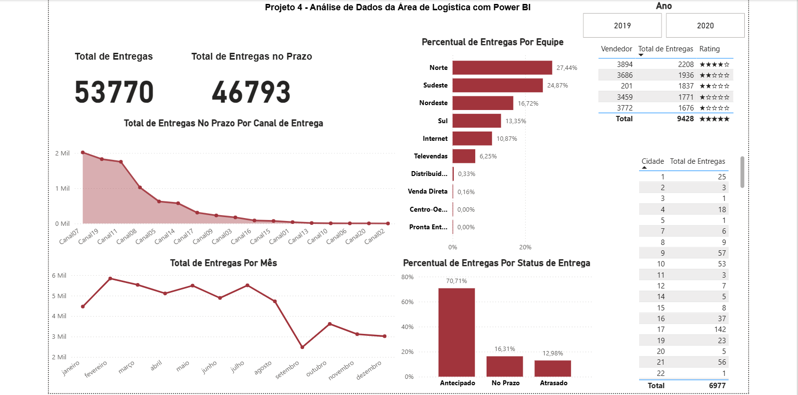

# 🚚 Dashboard de Logística em Power BI

## 📖 Sobre o Projeto

Este projeto apresenta um dashboard desenvolvido em **Power BI** para monitoramento de indicadores logísticos, permitindo acompanhar o desempenho das entregas e apoiar a tomada de decisões por meio da análise de dados.

Todas as métricas e indicadores foram desenvolvidos utilizando **DAX (Data Analysis Expressions)**, proporcionando cálculos dinâmicos e análises interativas.

---

## 🎯 Objetivos

- Monitorar o desempenho das operações logísticas.
- Acompanhar o volume de entregas realizadas.
- Avaliar o cumprimento dos prazos de entrega.
- Identificar o desempenho das equipes responsáveis pelas entregas.
- Fornecer indicadores estratégicos para apoio à tomada de decisão.

---

## 🛠️ Tecnologias Utilizadas

- 📊 Power BI
- 📐 DAX (Data Analysis Expressions)
- 🔄 Power Query
- 📄 Microsoft Excel

---

## 📈 Indicadores Desenvolvidos

- 🚚 Total de Entregas
- ✅ Entregas no Prazo
- 📅 Entregas por Mês
- 👥 Percentual de Entregas por Equipe
- 📊 Evolução Mensal das Entregas
- 📈 Indicadores de Performance Logística

---

## 📊 Dashboard

---

## ⚙️ Processo de Desenvolvimento

- Importação dos dados
- Tratamento e limpeza utilizando Power Query
- Modelagem dos dados
- Criação de medidas em DAX
- Desenvolvimento dos indicadores (KPIs)
- Construção dos gráficos e painéis interativos
- Validação dos resultados

---

## 🧠 Principais Medidas DAX

Entre as medidas desenvolvidas estão:

- Total de Entregas
- Entregas no Prazo
- Percentual de Entregas no Prazo
- Entregas por Equipe
- Percentual de Participação por Equipe
- Entregas Mensais
- Crescimento Mensal das Entregas

---

## 💡 Insights Obtidos

- Comparação do desempenho entre equipes.
- Identificação dos períodos com maior volume de entregas.
- Monitoramento do percentual de entregas realizadas dentro do prazo.
- Acompanhamento da evolução das operações logísticas ao longo do tempo.
- Apoio à identificação de oportunidades para melhoria da eficiência operacional.

## 👨‍💻 Autor

**Guilherme Polato**
